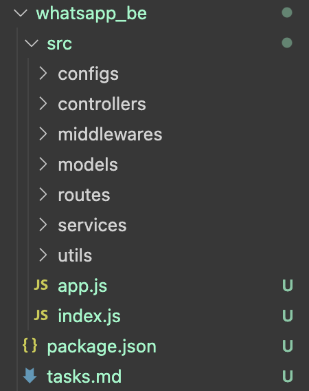
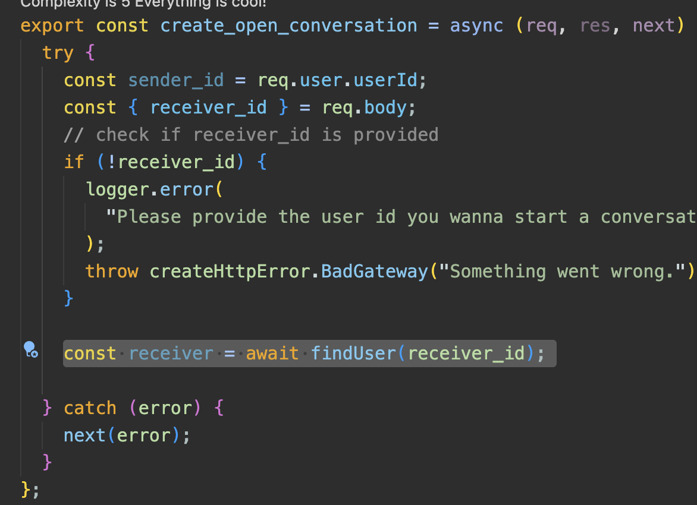
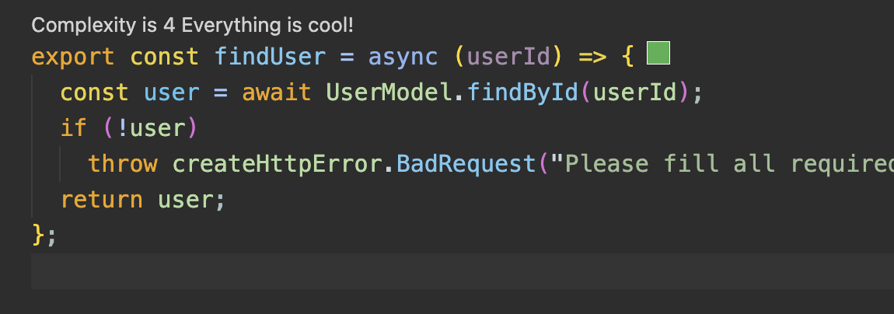

# Init Backend

## Backend Settings

1. init project: `yarn init`
2. create dirs:
   

3. add scripts in the `package.json`

4. yarn add nodemon

   ```json
   "scripts": {
   	"start": "nodemon ./src/index.js"
    },
   ```


## express

`yarn add express`

```javascript
const express = require("express");
const app = express();
```

manage secured info: 

instead of using `const PORT = "xxx"`, use `.env`  

`yarn add dotenv`

```javascript
const dotenv = require("dotenv");

// dotEnv config
dotenv.config();

const PORT = process.env.PORT || 8081;
```


change the "type" to module, use `import` rather than `require`

in package.json:`"type": "module",`

index.js:

```javascript
import express from "express";
const app = express();

// dotenv config
import dotenv from "dotenv";
dotenv.config();

// create express app
const PORT = process.env.PORT || 8081;

app.listen(PORT, () => {
  console.log("serer is listening on ", PORT, "...");
});

export default app;

```


reorganize `app.js` and `index.js`

`app.js`:

```javascript
import express from "express";

// create app
const app = express();
export default app;

```

`index.js`:

```javascript
import app from "./app.js";
import dotenv from "dotenv";

// dotEnv config
dotenv.config();

// dot variables
const PORT = process.env.PORT || 8081;

app.listen(PORT, () => {
  console.log("serer is listening on ", PORT, "...");
});

```

note:

```javascript
console.log(`serer is listening at ${PORT}...`);
```


## middleware

+ Run scripts that set and use environment variables across platforms with cross-env.

  `yarn add cross-env`

  ```javascript
   "start": "node ./src/index.js",
   "dev": "cross-env NODE_ENV=development nodemon ./src/index.js"
  ```

  `yarn start` -> `yarn dev`

+ Adding `Morgan`  middleware as an HTTP request logger middleware for node js.

  ```shell
  ::1 - - [Sun, 20 Oct 2024 19:20:33 GMT] "POST / HTTP/1.1" 200 14 "-" "PostmanRuntime/7.42.0"
  ::1 - - [Sun, 20 Oct 2024 19:20:41 GMT] "GET / HTTP/1.1" 200 14 "-" "PostmanRuntime/7.42.0"
  
  ```

+ Add `Helmet` middleware, Helmet helps you secure your Express apps by setting various HTTP headers.

+ Adding Express json and urlencoded middleware to parse json request from body and url.

+ Adding `Express-mongo-sanitize` middleware which sanitizes user-supplied data to prevent MongoDB Operator Injection.

+ Adding `Cookie-parser` middleware to parse Cookie header and populate req.cookies with an object keyed by the cookie names.

+ Adding `Compression` middleware to compress response bodies for all request that traverse through the middleware.

+ Adding `Express-fileupload` middleware to make uploaded files accessible from req.files.

+ Adding `cors` middleware to protect and restrict access to the server.

  ```java
  app.use(
    cors({
      origin: "http://localhost:3000",
    })
  );
  ```


## Custom logger, handle Server and http errors

Adding a custom logger, Handling uncaughtException, unhandledRejection errors, SIGTERM, and handle http errors.

**Objectifs**

- Adding a custom logger to use instead of using the boring console.log to help us read the console better and separate errors from infos.

  ```javascript
  import logger from "./configs/logger.config.js";
  
  logger.info(`serer is listening at ${PORT}...`);
  
  logger.info()
  ```

  

- Handle Server closing when facing uncaughtException, unhandledRejection errors.

  ```javascript
  const exitHandler = () => {
    if (server) {
      logger.info("Server closed.");
    }else{
      process.exit(1);
    }
  };
  
  const unexpectedErrorHandler = (err) => {
    logger.error(err);
    // process.exit(1);
    exitHandler(err)
  };
  
  process.on("uncaughtException", unexpectedErrorHandler);
  process.on("unhandledRejection", unexpectedErrorHandler);
  
  ```

  

- Close server gracefully on SIGTERM signal.

  ```javascript
  // SIGTERM
  process.on("SIGTERM", () => {
    if (server) {
      logger.info("Server closed.");
      process.exit(1);
    }
  });
  
  ```

  

- Handle http errors and get proper error messages from server.

  `yarn add http-error`

  ```javascript
  app.use(async (err, req, res, next) => {
    res.status(err.status || 500);
    res.send({
      error: {
        status: err.status || 500,
        message: err.message,
      },
    });
  });
  
  🌟 next()
  
  //test:
  app.get("/error", (req, res) => {
    throw createHttpError.BadRequest("this route has an error.");
  });
  ```

  without async：

  ```html
  <!DOCTYPE html>
  <html lang="en">
  
  <head>
      <meta charset="utf-8">
      <title>Error</title>
  </head>
  
  <body>
      <pre>BadRequestError: ... </pre>
  </body>
  
  </html>
  ```

  with async: 

  ```json
  {
      "error": {
          "status": 400,
          "message": "this route has an error."
      }
  }
  ```


## Setup routes and controllers

Adding routes setup and controllers functions.

**Objectifs**

- Add routes setup and files.

- Trim incoming requests. (trim-request)

  ```
  {"body":"[   ]hello world[       ]"}
  ⬇️
  router.route("/register").post([trimRequest.all,]register);
  ```

  

- **Add controllers functions.** Separated from routers

```
routes
├── auth.route.js: router.route(path).METHOD((req, res) => {}) export
└── index.js: import router.use("prefix", cusRoute)

in app.js:
app.use("/api/v1", routes);


controllers
└── auth.controller.js

import { register } from "../controllers/auth.controller";
const router = express.Router();
router.route("/register").post(register);

```

🌟recommened prefix rule: `"/api/v1"`


## Integrate Mongodb to our application

Let's add mongodb as our main database.

**Objectifs**

- Create a mongodb cluster.
- Connect to the database from our express app.
- Handle mongodb connection errors.
- Activate debugging mode.

```
.env
DATABASE_URL=xxx.net/database_name

index.js
const { DATABASE_URL } = process.env;

yarn add mongoose
```

---


# Authentication

model + controller(function)

## **User model**

create the user model.

```
models
├── index.js
└── useModel.js
└── xxxModel.js
```

**Objectives**

- Create a user model.

- Learn the **proper validation** for Mongoose schema.

  ```js
  const userSchema = mongoose.Schema({
    name: {
      type: String,
      required: [true, "Please provide your name"],
    },
    ...
    
  });
  ```

  

- Use `validator`  in the model schema.

  ```js
   email: {
      type: String,
      required: [true, "Please provide your email address"],
      unique: [true, "This email address already exist"],
      lowercase: true,
      validate: [validator.isEmail, "Please provide a valid email"],
    },
  ```

  

create Schema:

```js
const userSchema = mongoose.Schema({
  name: {
    type: String,
    required: [true, "Please provide your name"],
  },
});
```

🌟：why not only `true`, but also message *(#18, 3:00)*

​	Do **VALIDATION** here

​	data: validate in the frontend, validate in the server, validate the schema


## **Register a user**

register function for the user.

**Objectives**

- Validate the user data.

- Create a `service` to add the user to the database.

  ```
  services
  └── auth.service.js
  ```

  ```js
  // controller
  try {
      // fetch fields we want
      const { name, email, picture, status, password } = req.body;
  
      const newUser = 👉await👈 createUser({
        name,
        email,
        picture,
        status,
        password,
      });
  
      res.status(200).send("OK");
    } 👉catch (error) {👈
      next(error);
    }
  };
  
  
  // service
  export const createUser = 👉async👈 (userData) => {
    const { name, email, picture, status, password } = userData;
    //Validation
    // check if fields are empty
    if (!name || !email || !password) {
      👉throw createHttpError.BadRequest("Please fill all fields");👈
    }
  };
  
  
  ```

- use Bcrypt to hash password on presave in user model

  Building UserModel: `pre`
  
  ```javascript
  userSchema.pre("save", async function (next) {
    try {
      if (this.isNew) {
        const salt = await bcrypt.genSalt(12);
        const hashedPassword = await bcrypt.hash(this.password, salt);
        this.password = hashedPassword;
      }
    } catch (error) {
      next(error);
    }
  });
  
  ```
  
  🌟**We didn't do the hashing in the server, but in the schema itself!**
  
- Generate access and refresh tokens. **(JWT)**

  1. `.env` set `ACCESS_TOKEN_SECRET` and `REFRESH_TOKEN_SECRET`

  2. ctoken.service.js: generateToken

  3. set cookie

- Store the refresh token in the cookies.

- Send back the user data to the frontend.


model v.s. controller

```js
// in controller
export const register = async (req, res, next) => {
  try {
    👉 const { name, email, picture, status, password } = req.body; 👈
  } catch (error) {
    res.status(500).json(next(error));
  }
};
```


🌟configure default value in `.env` + **Destructuring Assignment**

```javascript
// env variables
const { DEFAULT_PICTURE, DEFAULT_STATUS } = process.env;

```


# Conversation

🌟in create_open_conversation

needs to call functions in service.js

since the error has been handled by throwing new errors in service.js. there's no need to handle it in the callee function again. 

also don't forget to use await. 





---


# Problems & Solutions

+ Run scripts that set and use environment variables across platforms with cross-env.

+ forgot to ignore node_modules & .env 

  1. update .gitignore

  2. git rm -r --cached 
  3. git add . / git commit again
  4. push

+ md中npm package + version

+ `next()` in Express

  https://stackoverflow.com/questions/10695629/what-is-the-parameter-next-used-for-in-express

  ```javascript
  app.get("/", function(httpRequest, httpResponse, next){
      httpResponse.write("Hello");
      next(); //remove this and see what happens 
  });
  
  app.get("/", function(httpRequest, httpResponse, next){
      httpResponse.write(" World !!!");
      httpResponse.end();
  });
  
  //without next(), the requiest for '/' never ends
  ```

  

  1. middleware： app.use()

  2. routing
  3. depends on the order of the usage of `use`

  

  + missing middleware

    ```
    export const register = async (req, res, next) => {
      try {
        console.log("* ckp");
        console.log(req.body);
        res.send(req.body);
      } catch (error) {
        res.status(500).json(next(error));
      }
    };
    output:
    * ckp
    undefined
    ```

    check app.js:

    ```
    // routes
    app.use("/api/v1", routes);
    
    ...
    
    // parse json request body
    app.use(express.json());
    
    ```

    place json before route

+ fail to load env variables using dotenv

  `.env` must be under the same dir as package.json

+ fail to use the default value (while it works in other js)

  ```javascript
  const user = await new UserModel({
      name,
      email,
      picture: picture ?? DEFAULT_PICTURE,
      status: status ?? DEFAULT_STATUS,
      password,
    }).save();
  };
  
  ```

  sol: make sure configuring the dotenv at the top of everything in the entry js (index.js) + 

  > https://stackoverflow.com/questions/59444928/process-env-doesnt-show-variables-outside-app-js

  ```javascript
  import dotenv from "dotenv";
  // dotEnv config
  dotenv.config();
  
  import app from "./app.js";
  import logger from "./configs/logger.config.js";
  import mongoose from "mongoose";
  
  ```

  
