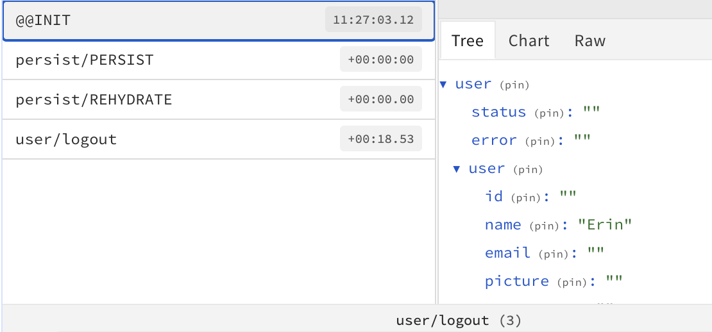

## Tailwind css

> https://tailwindcss.com/docs/installation

use `className = "xxx"`

edit preset:

```javascript
/** @type {import('tailwindcss').Config} */
module.exports = {
  content: ["./src/**/*.{js,jsx,ts,tsx}"],
  darkMode: "class", 👈
  theme: {
    extend: {
      colors: {
        dark_bg_1: "#111B21",
        dark_bg_2: "#202C33",
        ...
      },
    },
  },
  plugins: [],
};

```

```
@layer components {
  .customh1 {
    @apply text-blue-500 bg-red-200;
  }
}
```


switch to dark mode: parents' `className`	


从图片中提取的文字如下：

------

## react router dom

setup react router dom and add custom routes.

**Objectifs**

- Let's install react-router-dom@6.
- Explain it a little bit.
- Add custom routes.


```javascript
import { BrowserRouter as Router, Routes, Route } from "react-router-dom";
import Home from "./pages/home.js";
function App() {
  return (
    <div className="dark">
      <Router>
        <Routes>
          <Route exact path="/" element={<Home />} /> 👈
        </Routes>
      </Router>
    </div>
  );
}

export default App;

```

use router:

```javascript
// 🔗 http://localhost:prot/
<Route exact path="/" element={<Home />} />
  
// 🔗 http://localhost:prot/login
<Route exact path="/login" element={<Login />} />
  
// 🔗 http://localhost:prot/register
<Route exact path="/register" element={<Register />} />
```


------

## 🌟Redux toolkit

setup Redux toolkit and persist data.

**Objectifs**

- Create a global redux store.
- Create user slice.
- Explain how to dispatch actions.
- Add redux persist to keep data saved after refresh.


key:

1. dispatch: trigger Action
2. Store: dispatch Action to Reducer
3. Components: subscribe 


HOC: both params and return value are components

**Core concepts of React-Redux:**

- `connect(mapStateToProps, mapDispatchToProps)(Component)`

  The `connect` method takes two parameters and returns a higher-order component.

  - The first parameter of the `connect` method is the `mapStateToProps` function, which maps the state from the store to the component's `props`.
  - The second parameter of the `connect` method is the `mapDispatchToProps` function, which maps the `dispatch` from the store to the component's `props`.

  The `connect` method can also subscribe to the store, helping us re-render the component when the state in the store changes.


```
├── app
│   └── store.js
├── favicon.ico
├── features
│   └── userSlice.js
```


```javascript
// userSlice
import { createSlice } from "@reduxjs/toolkit";

const initialState = {
  status: "",
  error: "",
  user: {
    id: "",
    name: "",
    email: "",
    picture: "",
    status: "",
    token: "",
  },
};

export const userSlice = createSlice({
  name: "user",
  initialState,
  reducers: {
    logout: (state) => {
      state.status = "";
      state.error = "";
      state.user = {
        id: "",
        name: "",
        email: "",
        picture: "",
        status: "",
        token: "",
      };
    },
  },
});

export const { logout } = userSlice.actions;

export default userSlice.reducer;

```


```javascript
// index.js
import { Provider } from "react-redux";
import { store } from "./app/store.js"; 👈

const root = ReactDOM.createRoot(document.getElementById("root"));

root.render(
  <Provider store={store}> 👈
    <App />
  </Provider>
);

```


```javascript
// store.js
import { combineReducers, configureStore } from "@reduxjs/toolkit";
import { userSlice } from "../features/userSlice";

const rootReducer = combineReducers({
  user: userSlice.reducer,
});

export const store = configureStore({
  reducer: rootReducer,
  devTools: true,
});

```


redux devtools:

> https://github.com/reduxjs/redux-devtools


```javascript
//dispatch:
function App() {
  const dispatch = useDispatch();
  return (
    <div className="dark">
      <button
        onClick={() => {
          dispatch(logout());
        }}
      ></button>
```


## Redux persist

use redux persist to rehydrate only certain values

*save* selected info (e.g. `user` in user) 


Lib, config, reducer

```javascript
import { persistReducer, persistStore } from "redux-persist";
import storage from "redux-persist/lib/storage";
// persist config
const persistConfig = {
  key: "user",
  storage,
};


const persistedReducer = persistReducer(persistConfig, rootReducer);


export const persistor = persistStore(store);


export const store = configureStore({
  reducer: persistReducer,
  devTools: true,
});

```


how to save part of state:

`yarn add redux-persist-transform-filter`

```javascript
// saveUserOnlyFilter
const saveUserOnlyFilter = createFilter("user", ["user"])

// persist config
const persistConfig = {
  key: "user",
  storage,
  whitelist: ["user"], 👈
  transforms: [saveUserOnlyFilter] 👈
};
```


disable serializableCheck:

```javascript
export const store = configureStore({
  reducer: persistedReducer,
  middleware: (getDefaultMiddleware) =>
    getDefaultMiddleware({
      serializableCheck: false,
    }),
  devTools: true,
});
```


explanation:



init: 

user: status, error, user(name:"Erin")

logout: status, error, user(name:"logout")

persist/PERSIST: status, error, user(name:"logout")

Persist/REHYDRATE: **user(name:"logout")**


# Problems & Solutions

1. Redux-devtools cannot trace the state

   ```javascript
   import { combineReducers, configureStore } from "@reduxjs/toolkit";
   import { userSlice } from "../features/userSlice.js";
   
   const rootReducer = combineReducers({
     user: userSlice 👈 modified to: userSlice.reducer
   });
   
   export const store = configureStore({
     reducer: rootReducer,
     devTools: true,
   });
   
   ```

   

